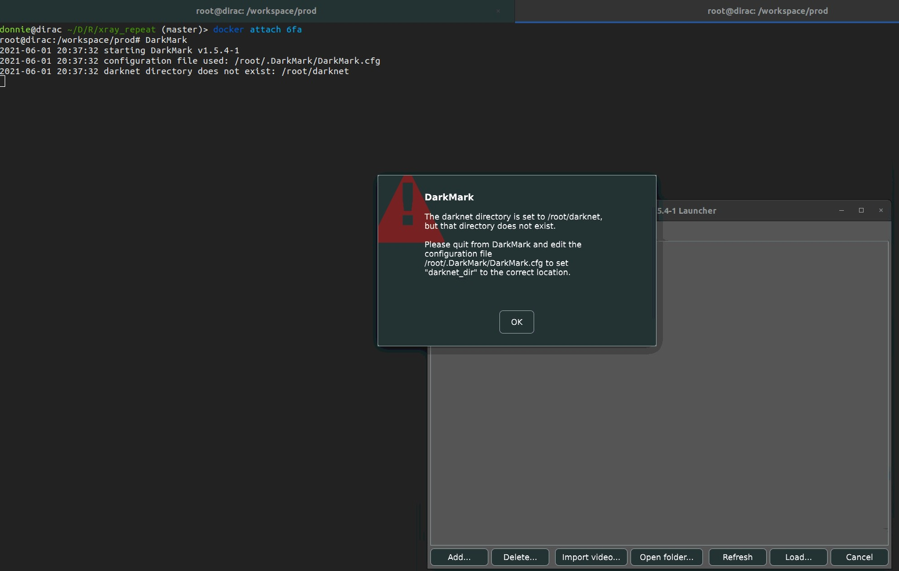
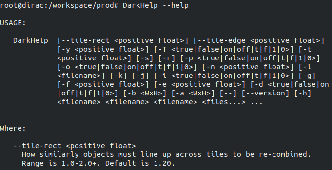

# DarkDocker

This repository is about containerizing [DarkMark](https://github.com/stephanecharette/DarkMark) application developepd by Stephane Charette. 

This repository has 2 files, namely `Dockerfile` for docker build recipe and `docker-compose.yaml` to organize docker run commands. 

Before we jump into building a docker image using the Dockerfile, I must admit that I only tested the build under the following environment

1. **UBUNTU**: 18.04.5 LTS (Kernel version 5.4.0-72-generic)
2. **Docker**: 20.10.6, build 370c289
3. **docker-compose**: 1.28.6, build 5db8d86f
4. **NVIDIA DRIVER**: 465.19.01
5. **CUDA**: 10.2

**docker-compose** is not a must, but will simplify/organize your docker run commands significantly. 

If you do not plan to incorporate NVIDIA GPU capabilities, then option 4 and 5 can be ignored. At the moment, I assume that a user wants to use GPU within a docker container.

It is possible that there are other factors that play a role in sucess of image build. I am merely suggesting what I have done to containerize the DarkMark with GPU and hopefully the users find this as a guide but not an ultimate sucess.

Lastly, things can get really confusing real quick while installing and I will do my best to explain as much as possible in detail with references. If my explanations do not make sense, I highly suggest go to the reference links directly and learn.


# Requirements

## Docker
If you are on this page, I assume you already have Docker installed, but in case you do not, please visit [here](https://docs.docker.com/engine/install/). Again, I only tested the docker build with version **20.10.6, build 370c289**, so you might wanna match the version or higher.

Just a side note, when installing, make sure you also do Post-installation process so that you can run docker without "sudo". Also add a group called `docker` and make it as a sudo user. These are not required, but will be handy.

## nvidia-container-toolkit
In order to run docker with NVIDIA GPU capabilities, one must install [nvidia-container-toolkit](https://docs.nvidia.com/datacenter/cloud-native/container-toolkit/install-guide.html). Please follow the instructions there.

## nvidia-container-runtime
According to the nvidia-container-toolkit website, when installing, it will automatically registers the runtime to be NVIDIA. But when I did it, it somehow did not. So just to be perfectly safe, let's add the NVIDIA Runtime manually. There are [many ways](https://docs.nvidia.com/datacenter/cloud-native/container-toolkit/user-guide.html#adding-the-nvidia-runtime) to do it, but I personally did by editting Daemon configuration file.

```
sudo tee /etc/docker/daemon.json <<EOF
{
    "runtimes": {
        "nvidia": {
            "path": "/usr/bin/nvidia-container-runtime",
            "runtimeArgs": []
        }
    }
    
    "default-runtime": "nvidia" # this is optional
}
EOF
```

If you DO NOT want to make default runtime to be nvidia, please comment out `default-runtime: "nvidia"`


# Dockerfile

**WARNING: YOU MUST EDIT DOCKERFILE SO THAT IT MATCHES YOUR HARDWARE REQUIREMENTS AND YOUR NEEDS.**

The Dockerfile is more or less straightforward if you are familiar with how to write one. But in short, the image starts with `nvidia/cuda:10.2-cudnn8-devel-ubuntu18.04`, git clones the repositories, and then buils in order of darknet, DarkHelp, and finally DarkMark. I intentially did multistage build so that I can refer to each stage. By multistage build, I meant there are 3 stages (darknet, DarkHelp, and DarkMark) of the build in `Dockerfile`:
```
FROM nvidia/cuda:10.2-cudnn8-devel-ubuntu18.04 as darknet
...
FROM darknet as DarkHelp
...
FROM DarkHelp as DarkMark
...
```
You cerrtainly do not have to do multistage build here (you do multistage build for either security reasons or reducing the image size), but I did it so that I can refer to them as I explain the file.

Under `darknet` build stage, the Makefile must be editted and the following line does that job. 

```
############# EDIT darkent MAKEFILE #############
# CHANGE OPTIONS HERE. 
# THE CODE BELOW CHANGES OPTTIONS IN MAKEFILE in darknet REPO. I HIGHLY SUGGEST READING MAKEFILE B4 EDITTING HERE
# For example, if you want GPU=0 to be GPU=1, then s/GPU=0/GPU=1/1. THIS PART IS TOTALLY UPTO USER'S CHOICE
# DEFAULT GPU=0, CUDNN=1, CUDNN_HALF=1, OPENCV=1, LIBSO=1
RUN sed -i -e 's/GPU=0/GPU=1/1' -e 's/CUDNN=0/CUDNN=1/1' -e 's/CUDNN_HALF=0/CUDNN_HALF=1/1' -e 's/OPENCV=0/OPENCV=1/1' -e 's/LIBSO=0/LIBSO=1/1' Makefile
```

According to the [darknet repo](https://github.com/AlexeyAB/darknet#how-to-compile-on-linux-using-make), there are several variables you need to configure to build. The line `RUN sed ...` changes these variables. For example,

```
RUN sed -i -e 's/GPU=0/GPU=1/1' Makefile
```

The above command will change `GPU=0` to `GPU=1` in Makefile for the 1st occurence of `GPU=0`. By default, I set `GPU=1`, `CUDNN=1`, `CUDNN_HALF=1`, `OPENCV=1`, `LIBSO=1`. Feel free to change them to meet your needs.

Also, you must configure the NVIDIA compute capabilities and this depends on your GPU. To figure out what your GPU compute capability, first run `nvidia-smi --query-gpu=name --format=csv,noheader` to obtain your GPU name. Then google your GPU's name and find out. For example, if your GPU is Quadro 4000, then the compute capability is 7.5. [Makefile](https://github.com/AlexeyAB/darknet/blob/master/Makefile) in darkent already has lines that correspond to a various NVIDDIA GPU cases and the user just needs to uncomment the line that matches his/her GPU compute capability. The following line does that job for you: 

```
# CHANGE HERE BASED ON YOUR GPU CAPABILITY. FOR EXAMPLE, IF YOU ARE USING RTX20XX SERIES, THEN '/arch=compute_75/s/^#//1'
# DEFAULT compute_75 (i.e. RTX 20xx series and QUADRO RTX series in general)
RUN sed -i '/arch=compute_75/s/^#//1' Makefile
```

# Build
Once you followed the above steps, one can build the image. Assuming you are under `DarkDocker`:
```
docker build -t dark_docker .
```
This should not take too long to build (on my desktop, around 16 min).

# docker-compose & enabling X-11 forwarding + GPU
Running Docker using command line is surely a viable option, but as we pass along many arguments, especially with consideration of x-11 forwarding + GPU option, things get clunky very fast. Hence, I prefer organizing the docker commands into a yaml file and run. To install docker-compose, please follow this [link](https://docs.docker.com/compose/install/). 

Just a fair warning. Not everyone's computer environment is the same as mine, and cannot guarantee this section would work for users such that they can use `DarkMark` GUI. But, the general ideas are all here and there are excellent articles that I found while working on enabling X11 forwarding with Docker, in particular [here](https://dzone.com/articles/docker-x11-client-via-ssh) and [here](https://zjli2013.github.io/2019/11/29/X11-GUI-in-docker/). Please read those if you cannot run successfully.

docker-compose.yml file has the following content:

```
version: "3.9"

services:

  bash:
    image: DarkDocker
    volumes: 
      - $HOME/.Xauthority:/root/.Xauthority:rw
      - /mnt:/mnt
      # - YOUR_DATA_VOL:DESIRED_PLACE_YOUR_DATA_VOL_TO_BE_MOUNTED
    environment:
      - DISPLAY=$DISPLAY
    network_mode: "host"
    tty: true
    stdin_open: true
    deploy:
      resources:
        reservations:
          devices:
          - driver: nvidia
            device_ids: ['0']
            capabilities: [gpu]
    entrypoint: ["/bin/bash"]
```

**bash** is the name of the service we will run.

The **image** is the one that we just built, `DarkDocker`. 

For **Volumes**, you must pass your `.Xauthority` for X11 authentication of X sessions. Also, you can mount any other directories that you want under there (for example, mount your directory `mnt` under `mnt` in Docker). The dockerfile already created a directory called `workspace` and starts from there when you run the image (unless you specify otherwise). You can throw your files/directories there if desired.

For **environment**, you must provide `DISPLAY` value if you plan to use `DarkMark` GUI. MAKE SURE YOUR TERMINAL SUPPORTS X11 FORWARDING (use [MobaXterm](https://mobaxterm.mobatek.net/) or [Putty](https://www.putty.org/) for X terminal if Windows. For UBUNTU, your default terminal should work). Also, make sure you have `DISPLAY` set up correctly by:

```
donnie@dirac ~> echo $DISPLAY
:1
```

If you do not have any value returned, 2 possible scenarios:
1. Your terminal does not support X-11 forwarding
2. Under `/etc/ssh/sshd_config`, `X11Forwarding` is not set to `yes`

There are other possible reasons why your `DISPLAY` is not returning, but for sanity check, please ensure those 2 options configured correctly.

For **network_mode**, set it to be "host" for x-11 forwarding.

For **tty** and **stdin_open**, set both of them to be true so that when we run docker image, we connect a pseudo terminal to the user's terminal and keeps STDIN open even if not attached (if you are familiar with `docker run -it` command, this is the line that does `-it` part).

For **deploy** part, this is where you specify your GPU and expose the docker container to it. The only part you really need to replace is `device_ids`. By default, I set it to be 0, but depending on the user's setup, it might be a different number or wanna expose multiple GPUs (list them with a comma separation. e.g. ['0','1']). You can refer to the [manual](https://docs.docker.com/compose/gpu-support/) for more details.

Before running the `bash` service, we wanna configure one more thing on your terminal. At the moment, most likely, user "docker" does not have control acess to "x". To enable the access, simply run:

```
xhost +local:docker
```

or if you wanna give it to root, simply replace `docker` with `root`. **Warning, if you close your terminal and reopen, you need to run the above command again as it is a temporary access.** If you want it to be a permanent behavior, you can save the above command under `.bashrc` and add `source ~/.bashrc` under `~/.profile`.

Now in order to run the `bash` service, simply type:

```
docker-compose up -d bash
```

This will bring the `bash` service up in detached mode. To attach the docker terminal that just opened, run

```
docker attach darkdocker_bash_1
```

or you can run `docker ps` to inspect the name of the container and use that name to attach.

At this point you should be in the terminal of the docker that you just ran and should be good to go! When you prompt

```
DarkMark
```

You should see the familiar DarkMark GUI:


And for DarkHelp, just prompt:

```
DarkHelp options_user_wants_to_throw
```


That's it! Happy object detection!

# Sources
1. https://github.com/AlexeyAB/darknet
2. https://github.com/stephanecharette/DarkHelp
3. https://github.com/stephanecharette/DarkMark
4. https://docs.nvidia.com/datacenter/cloud-native/index.html
5. https://arnon.dk/matching-sm-architectures-arch-and-gencode-for-various-nvidia-cards/
6. https://docs.docker.com/compose/install/
7. https://dzone.com/articles/docker-x11-client-via-ssh
8. https://zjli2013.github.io/2019/11/29/X11-GUI-in-docker/